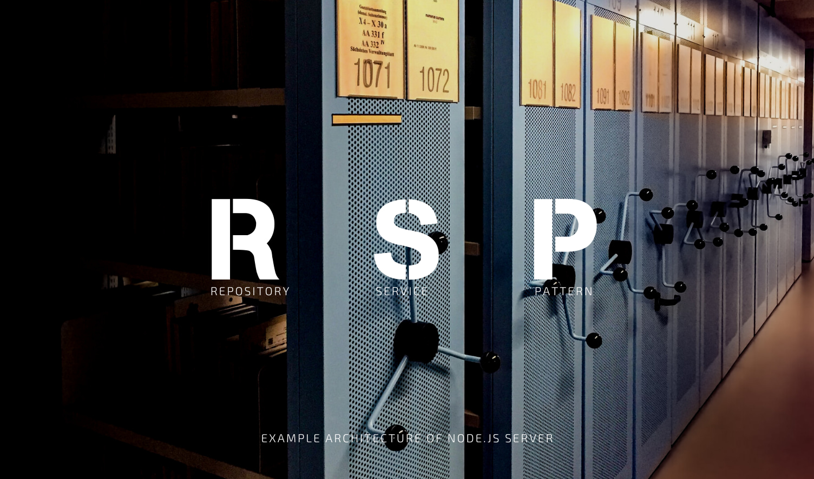

# Node.js Structure Example

[](https://travis-ci.com/TanyaDolgopolova/repository-service-pattern)

The main purpose of this repository is to show a working Node.js API Server and workflow for writing Node code in TypeScript.


# About

On the repository structure I use pattern named **'Repository-Service Pattern'**. 
The Repository-Service pattern breaks up the business layer of the app into three distinct layers.

> Advantage of that pattern is clear and consistent separation of concerns between the layers of the architecture. 
> This gives us the ability to change one layer with minimal impact to the others, and since we also have a clear understanding as to what each layer is supposed to contain. 
> We can implement changes quickly and with minimal code.

1. The lower layer is the **Repositories**. 
In that files we get data from database, with the important caveat that each Repository only works against a single Model class. So, for each model it need to be created repository.

2. The upper layer is the **Services**.
These classes will have Repositories injected to them and can query multiple Repository classes and combine their data to form new, more complex business objects. Further, they introduce a layer of abstraction between the web application and the Repositories so that they can change more independently.

3. The uppermost layer is the **Controller**. 
The Controller layer here need to pass user input data to service. This layer can contain middleware or guards, also we can define here additional services like swagger to describe defined routes.

# Pre-reqs

To build and run this app locally you will need a few things:
- Install [Node.js](https://nodejs.org/en/)
- Install [VS Code](https://code.visualstudio.com/) (optional)

# Getting started

- Clone the repository
```
git clone --depth=1 https://github.com/TanyaDolgopolova/repository-service-pattern.git <project_name>
```
- Install dependencies
```
cd <project_name>
npm install
```

Finally, navigate to `http://localhost:3000` and you should see the template being served and rendered locally!

# TypeScript + Node

Feel free to use this as a reference for converting other Node.js projects to TypeScript.
The most obvious difference in a TypeScript + Node project is the folder structure.
In a TypeScript project, it's best to have separate _source_  and _distributable_ files.
TypeScript (`.ts`) files live in your `src` folder and after compilation are output as JavaScript (`.js`) in the `dist` folder.
The `test` and `views` folders remain top level as expected.

## Getting TypeScript

TypeScript itself is simple to add to any project with `npm`.
```
npm install -D typescript
```
If you're using VS Code then you're good to go!
VS Code will detect and use the TypeScript version you have installed in your `node_modules` folder.
For other editors, make sure you have the corresponding [TypeScript plugin](http://www.typescriptlang.org/index.html#download-links).

## License

MIT